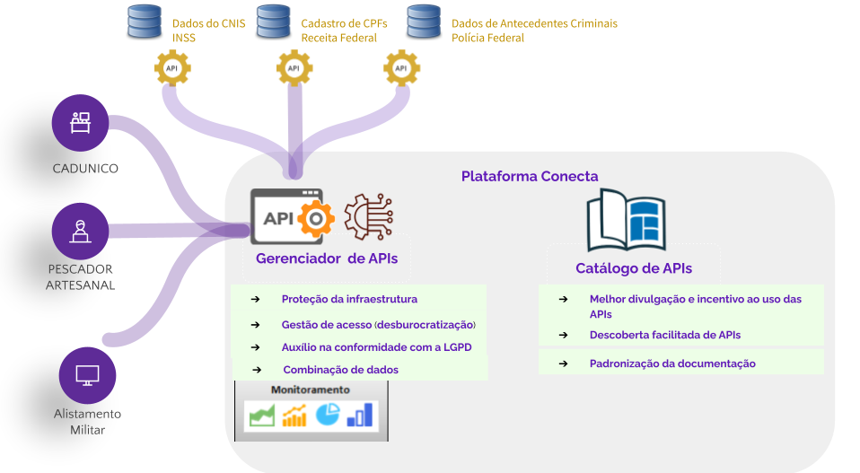

Introdução
============

Solução de gerenciamento para facilitar a disponibilização e o consumo de APIs e promover a interoperabilidade de dados entre Órgãos Públicos Federais.

A ideia do Gerenciador de APIs é facilitar a interoperabilidade de dados para os órgãos Provedores de Dados e o consumo das APIs para os órgãos Recebedores de Dados por meio de várias funcionalidades como a gestão do acesso às APIs, a proteção da infraestrutura, o controle de consumo e disponibilização de um ponto único de acesso à APIs.

Gerenciador de APIs do Conecta
-------------------------------

O que você tem interesse no Conecta?
************************************

  Quero receber Dados de outros órgãos (Acesse o Passo a Passo do Recebedor de Dados)
.. toctree::
   :maxdepth: 3
   :caption: Acesse o Passo a Passo do Recebedor de Dados
   recebedordados

  Quero disponibilizar Dados para outros órgãos (Acesse o Passo a Passo do Provedor de Dados)
.. toctree::
  :maxdepth: 3
  :caption: Acesse o Passo a Passo do Provedor de Dados
  provedordedados