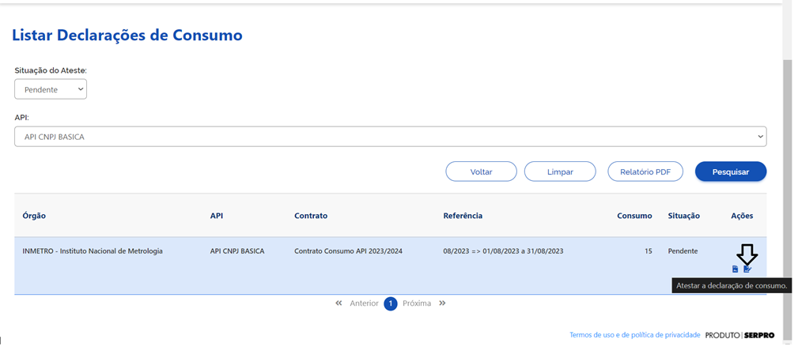

.. _secao-manual-declaracao-consumo:

.. _Gerenciador de APIs: url-portal-gestor-gerenciador-apis_
.. _url-portal-gestor-gerenciador-apis: http://gov.br/conecta/gerenciador

.. _Catálogo de APIs do Conecta: url-catalogo-conecta_
.. _url-catalogo-conecta: http://gov.br/conecta/catalogo

.. _Equipe do Conecta: email-equipe-conecta_
.. _email-equipe-conecta: conecta@economia.gov.br

.. _Conta gov.br: url-conta-gov-br_
.. _url-conta-gov-br: https://www.gov.br/pt-br/servicos/criar-sua-conta-meu-gov.br

.. |conta_govBR| raw:: html

	<a href="https://www.gov.br/pt-br/servicos/criar-sua-conta-meu-gov.br" target="_blank">Conta gov.br</a>

.. |catalogo_apis| raw:: html

   <a href="http://gov.br/conecta/catalogo" target="_blank">Catálogo de APIs</a>
   
   
.. |gerenciador_apis| raw:: html

   <a href="http://gov.br/conecta/gerenciador" target="_blank">Gerenciador de APIs</a>

########################################
Manual Declaração de Consumo
########################################

  O gestor do órgão poderá optar por assinar consultar e assinar as declarações de consumo diretamente pelo gerenciador de API do Conecta.
   
  No Menu Administração, selecionar Declaração de Consumo e Listar Declaração de Consumo.

   
  Seleciona a “Situação do Ateste” e a “API” desejada.
   
  Os atestes com situação “Pendente” são os que o gestor ainda não fez o ateste usando a funcionalidade da Plataforma de Gestão.
   
  Aciona o botão Pesquisar.
   
  O sistema lista todas as declarações de consumo pendentes de ateste.
   

   
  Na coluna Ação o usuário pode acionar a opção de visualizar o relatório.
   
  O sistema gera um relatório PDF e faz o download para o computador do usuário.
   

   
  Na coluna Ação o usuário aciona a opção Atestar Declaração de Consumo.
   

   
  O sistema apresenta a tela com o relatório.
   
  Usuário seleciona o tipo de certificado que vai usar para assinar o ateste e em seguida clica no botão Assinar.

   
  Neste exemplo o usuário selecionou certificado GOVBR.
   
  Usuário informa o código e aciona o botão Autorizar.
   
  Sistema envia e-mail para os envolvidos(Gestores do órgão cadastrados na Plataforma e SGD) no processo de ateste informando que o ateste foi efetuado.

  Sistema retorna para a tela de Declarações de Consumo.

   
