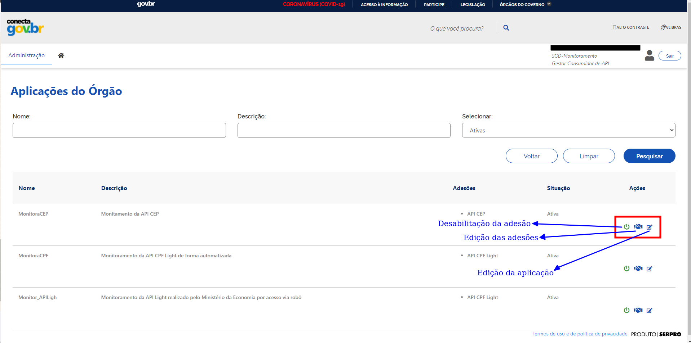

.. _secao-manual-recebedor-dados:

.. _Gerenciador de APIs: url-portal-gestor-gerenciador-apis_
.. _url-portal-gestor-gerenciador-apis: http://gov.br/conecta/gerenciador

.. _Catálogo de APIs do Conecta: url-catalogo-conecta_
.. _url-catalogo-conecta: http://gov.br/conecta/catalogo

.. _Equipe do Conecta: email-equipe-conecta_
.. _email-equipe-conecta: conecta@economia.gov.br

.. _Conta gov.br: url-conta-gov-br_
.. _url-conta-gov-br: https://www.gov.br/pt-br/servicos/criar-sua-conta-meu-gov.br

.. |conta_govBR| raw:: html

	<a href="https://www.gov.br/pt-br/servicos/criar-sua-conta-meu-gov.br" target="_blank">Conta gov.br</a>

.. |catalogo_apis| raw:: html

   <a href="http://gov.br/conecta/catalogo" target="_blank">Catálogo de APIs</a>
   
   
.. |gerenciador_apis| raw:: html

   <a href="http://gov.br/conecta/gerenciador" target="_blank">Gerenciador de APIs</a>

########################################
Manual do Recebedor de Dados
########################################

    Seções principais:
      -  `Roteiro para geração das chaves de acesso <#roteiro-geracao-chaves-acesso>`__
      -  `Cadastre as Aplicações <#cadastre-as-aplicacoes>`__
      -  `Geração das Chaves de Acesso <#geracao-chaves-acesso>`__

.. _roteiro-geracao-chaves-acesso:

---------------------------------------------------------
Roteiro para geração das chaves de acesso
---------------------------------------------------------

O Gestor do Órgão deverá:

  1. Cadastrar Aplicação

     O Gestor do Órgão cadastra as aplicações que realizarão o acesso à API.

       .. important:: Sugere-se que sejam cadastradas aplicações diferentes para sistemas diferentes do órgão, de tal forma que o controle de consumo possa ser feito de maneira mais detalhada.

       .. note:: Para cadastrar as aplicações siga as instruções em `Cadastre as Aplicações <#cadastre-as-aplicacoes>`__.

  2. Gerar chave de acesso

     O Gestor do Órgão assina o termo de responsabilidade para uso dos dados e gera a chave de acesso.
     Para cada aplicação, o Gestor do Órgão deve ler e assinar eletronicamente o termo de responsabilidade, com certificado digital, e gerar a chave de acesso que vai permitir a integração da aplicação com a API em questão. 

     O termo de responsabilidade é associado à chave de acesso gerada. Ressaltamos a necessidade do Gestor do Órgão fazer o download do termo de responsabilidade.

     Uma chave de acesso é uma sequência de números e letras (alfanumérico) que representam uma credencial de acesso. Esta credencial de acesso é informada no acesso a uma API para identificar o aplicativo de chamada ou o usuário e usada para monitorar e controlar a forma como a API está sendo utilizada.
     Quando gerada outra chave de acesso para a mesma aplicação, a chave de acesso anterior passa a ter um período de validade de 6 (seis) meses.
     As chaves de acesso não são armazenadas na plataforma e, portanto, não podem ser recuperadas. É responsabilidade do Gestor do Órgão armazenar a sua chave de acesso de forma segura.

       .. note:: Para geração das chaves de acesso siga as instruções em `Geração das Chaves de Acesso <#geracao-chaves-acesso>`__.

  3. Encaminhar internamente a chave de acesso para o responsável técnico.

.. _subsecao-funcionalidades-recebedor-dados:

---------------------------------------------------------
Funcionalidades para o recebedor de dados
---------------------------------------------------------

~~~~~~~~~~~~~~~~~~~~~~~~~~~~~~~~~~~~~~~~~~~~~~~~~~~~~~~~~
   1. Entre no Portal do Gestor
~~~~~~~~~~~~~~~~~~~~~~~~~~~~~~~~~~~~~~~~~~~~~~~~~~~~~~~~~

  Logue no |gerenciador_apis| utilizando sua |conta_govBR|.

.. tip::

     Pode-se acessar a conta tanto com senha ou certificado digital

Esta é a tela inicial para o perfil Gestor do Órgão:

.. image:: _imagens/comofazer.png
   :scale: 75 %
   :align: center
   :alt: Como fazer

.. _cadastre-as-aplicacoes:

~~~~~~~~~~~~~~~~~~~~~~~~~~~~~~~~~~~~~~~~~~~~~~~~~~~~~~~~~
   2. Cadastre as Aplicações
~~~~~~~~~~~~~~~~~~~~~~~~~~~~~~~~~~~~~~~~~~~~~~~~~~~~~~~~~

  >> No menu Administração, selecionar o item Aplicação >  Cadastro de Nova Aplicação.
  Nesta tela, o Gestor do Órgão deve:

    1. Preencher todos os campos com os detalhes da aplicação que irá realizar o acesso à API; 
    2. Associar a aplicação com a API desejada, selecionando na lista apresentada; e 
    3. Efetivar o cadastro pelo botão Incluir.

.. image:: _imagens/cadastraraplicacao_1.png
   :scale: 75 %
   :align: center
   :alt: Cadastrar Nova Aplicação.

Será exibida mensagem com o resultado da realização da inclusão, na parte superior da tela, abaixo do menu.
**Caso a inclusão seja realizada com sucesso:**

.. image:: _imagens/cadastraraplicacao_2.png
    :scale: 75 %
    :align: center
    :alt: Cadastrar Nova Aplicação.

Exemplo de preenchimento:

.. image:: _imagens/cadastraraplicacao_3.png
   :scale: 75 %
   :align: center
   :alt: Cadastrar Nova Aplicação.

~~~~~~~~~~~~~~~~~~~~~~~~~~~~~~~~~~~~~~~~~~~~~~~~~~~~~~~~~
   3. Liste as Aplicações Cadastradas
~~~~~~~~~~~~~~~~~~~~~~~~~~~~~~~~~~~~~~~~~~~~~~~~~~~~~~~~~

>> No menu Administração, selecionar o item Aplicação > Listar Aplicações
As aplicações já cadastradas pelo Gestor do Órgão são listadas.

.. image:: _imagens/listadeaplicacao_1.png
 :scale: 75 %
 :align: center
 :alt: Lista De Aplicações.

É possível definir filtros para lista apresentada por meio dos campos apresentados na parte superior da tela. O preenchimento dos campos de filtro de pesquisa é opcional e, quando não preenchido, realiza a pesquisa para todas as aplicações. 
O resultado da pesquisa será apresentado de forma paginada, conforme mostrado abaixo. 
A partir dos ícones apresentados na parte direita para cada item da lista, é possível realizar as seguintes ações para uma determinada aplicação listada:

   1. ativação/desativação.
   2. alteração.

+++++++++++++++++++++++++++++++++++++++++++++++++++++++++
     3.1. Ative ou Desative as Aplicações
+++++++++++++++++++++++++++++++++++++++++++++++++++++++++

  >> No menu Administração, selecionar o item Aplicação > Listar Aplicações
  Na lista de aplicações, cada aplicação, como item da lista, apresenta os *ícones de ação* à sua direita.
  Para ativação ou desativação de uma determinada aplicação, deve-se selecionar os ícones de **Desativação e/ou ativação**.
  
  .. image:: _imagens/ativardesativar_1.png
   :scale: 75 %
   :align: center
   :alt: Ativar desativar aplicação.

+++++++++++++++++++++++++++++++++++++++++++++++++++++++++++++++
     3.2. Altere as informações de uma Aplicação cadastrada
+++++++++++++++++++++++++++++++++++++++++++++++++++++++++++++++

  >> No menu Administração, selecionar o item Aplicação > Listar Aplicações
  Na lista de aplicações, cada aplicação, como item da lista, apresenta os *ícones de ação* à sua direita.
  Para alteração de uma determinada aplicação, deve-se selecionar o ícone **Edição da Aplicação**.

  .. image:: _imagens/alteraraplicao_1.png
   :scale: 75 %
   :align: center
   :alt: Alterar Aplicação.

.. _geracao-chaves-acesso:

~~~~~~~~~~~~~~~~~~~~~~~~~~~~~~~~~~~~~~~~~~~~~~~~~~~~~~~~~
   4. Geração das Chaves de Acesso
~~~~~~~~~~~~~~~~~~~~~~~~~~~~~~~~~~~~~~~~~~~~~~~~~~~~~~~~~

  >> No menu Administração, selecionar o item Gerar Chaves de Acesso.

.. image:: _imagens/gerarchave_1.png
   :scale: 75 %
   :align: center
   :alt: Gerar Chave de Acesso.

.. attention::
    Caso o órgão deseje utilizar o Certicado digital ICP-Brasil para assinatura do Termo de Responsbilidade, são requisitos para a geração da chave:
      * Gestor do Órgão possuir certificado digital ICP-Brasil.
      * Assinador Digital SERPRO estar instalado.
      
      Caso o órgão deseje utilizar a Assinatura Eletrônica Gov.br, o requisito para a geração da chave:
      * Ter em sua conta Gov.br o selo de Confiabilidade Prata ou Ouro. Caso o mesmo não tenha um destes selos de confiabilidade, no momento da geração das credenciais de acesso, será possível elevar o nivel da conta Gov.br.

.. tip::

As chaves de acesso são as credenciais que as aplicações cadastradas utilizarão para acessar as APIs desejadas.

++++++++++++++++++++++++++++++++++++++++++++++++++++++++++++++++++++++++++++++++++++++++++++++++++++++++++++++++
      4.1. Assinatura do Termo de Responsabilidade
++++++++++++++++++++++++++++++++++++++++++++++++++++++++++++++++++++++++++++++++++++++++++++++++++++++++++++++++

   O gestor do órgão poderá optar por assinar o Termo de Responsabilidade de duas formas. A primeira será utilizando a Assinatura Eletrônica Gov.br, e a segunda será utilizando um Certificado Digital ICP-Brasil e-CPF.
   
  Caso o órgão utilize a Assinatura Eletrônica Gov.br basta selecionar a aplicação cadastrada anteriormente, a API que deseja, selecionar o Certificado Gov.br, clicar em gerar chaves.
 
 .. image:: _imagens/gerarchave_assinador_gov.br.png
   :scale: 75 %
   :align: center
   :alt: Gerar Chave de Acesso.
   
   Após esta etapa, o gestor receberá em seu número de telefone cadastrado no Gov.br, um código de autorização para confirmação da assinatura. O gestor deve inserir o código e clicar em Autorizar.
   

   
   Após a autorização, basta clicar em gerar chaves de acesso.
   

   
   Caso o usuário não tenha uma conta nível Prata ou Ouro, no momento da geração da chave será apresentado a tela abaixo para que o mesmo eleve seu nível, caso queira. Clique em "Aumentar Nivel".
   
.. image:: _imagens/geracao de chave aumentar nivel.PNG
   :scale: 75 %
   :align: center
   :alt: Gerar Chave de Acesso.
   
   Clique em "Autorizar".
   

   
   Escolha para qual nível deseja aumenta, Ouro ou Prata.
   
 .. image:: _imagens/Escolha o nivel que deseja aumentar.PNG
   :scale: 75 %
   :align: center
   :alt: Gerar Chave de Acesso.
   
   Será enviado um codigo de confiramação via SMS para o o telefone cadastrado ou uma mensagem de validação para o e-mail. Confirme o código na plataforma.
   
    .. image:: _imagens/gerarchave_assinador_gov.br_mensagem_sms.png
   :scale: 75 %
   :align: center
   :alt: Gerar Chave de Acesso.
   
   Pronto. Sua conta foi aumentada para um maior nível de segurança e a tela voltara para tela inicial, onde poderá gerar as chaves de acesso conforme orientado no passo 4.1 deste manual. 
   
 .. image:: _imagens/apos mudar o acesso, voltara para pagina principal.PNG
   :scale: 75 %
   :align: center
   :alt: Gerar Chave de Acesso.
   
.. attention::

   Para a API CPF Light, CND e CNPJ a geração das credenciais continuam sendo somente por meio do Certificado Digital ICP-Brasil e-CPF.
 
   Caso o órgão utilize o Certicado digital ICP-Brasil para assinatura do Termo de Responsbilidade, o Portal do Gestor identificará automaticamente se o Assinador Digital SERPRO está instalado. Caso não tenha sido efetuada a instalação, a tela para gerar chaves de acesso apresenta as orientações para tanto.

.. image:: _imagens/gerarchave_2.png
   :scale: 75 %
   :align: center
   :alt: Gerar Chave de Acesso.

  Com o Assinador Digital SERPRO instalado, o Gestor do Órgão poderá prosseguir com a geração da chave. 
  Primeiramente, deve selecionar a aplicação para a qual deseja gerar uma chave de acesso, cadastrada anteriormente.

  .. image:: _imagens/gerarchave_3.png
   :scale: 75 %
   :align: center
   :alt: Gerar Chave de Acesso.
  
  Em seguida, deve selecionar a API que deseja acessar. Apenas APIs cujo Gestor do Órgão tem autorização são apresentadas para seleção.
  
  .. image:: _imagens/gerarchave_4.png
   :scale: 75 %
   :align: center
   :alt: Gerar Chave de Acesso.

  O Gestor do Órgão deve ler o Termo de Responsabilidade. Este Termo possui identificação única e dados do Gestor do Órgão. Se algum dado não estiver correto, o Gestor do Órgão deve entrar em contato pelo email conecta@economia.gov.br.

  Após a leitura, o Gestor do Órgão assina o Termo de Responsabilidade, utilizando o seu certificado digital.

  Para finalizar e realizar a geração da chave de acesso, deve acionar o botão "Gerar Chave", embaixo, à direita.
  Quando a geração da chave foi realizada com sucesso, é apresentada tela com mensagem de sucesso no topo e a chave de acesso e a senha como campos editáveis na parte de baixo da tela.
  
  O Gestor do Órgão encaminha as chaves de acesso para o responsável técnico pelo sistema recebedor da API que deverá fazer a implementação necessária para acessar a mesma.
  
  .. image:: _imagens/gerarchave_5.png
   :scale: 75 %
   :align: center
   :alt: Gerar Chave de Acesso.

  O Gestor do Órgão deve copiar e salvar a chave de acesso e a senha, apresentadas como campos editáveis na parte de baixo da tela, em arquivo seguro. Não é possível recuperar essas informações após sair desta tela.
  Em caso de perda ou necessidade de geração de nova chave, deverá seguir novamente o processo aqui descrito, com a assinatura de um novo Termo de Responsabilidade e revogação da chave anterior.
  O Gestor do Órgão também deve salvar o Termo de Responsabilidade. Para tanto, deve acionar o botão “Termo de Responsabilidade”. Não é possível recuperar o Termo de Responsabilidade após sair desta tela. 

~~~~~~~~~~~~~~~~~~~~~~~~~~~~~~~~~~~~~~~~~~~~~~~~~~~~~~~~~
   5. Como acontece o acesso da minha aplicação?
~~~~~~~~~~~~~~~~~~~~~~~~~~~~~~~~~~~~~~~~~~~~~~~~~~~~~~~~~

  A chave de acesso é composta por um código de usuário e uma senha (chave pública e chave privada). O Portal do Gestor armazena somente o código do usuário para realizar a associação com o termo de responsabilidade assinado digitalmente pelo Gestor do Órgão. A chave privada enviada ao gestor não é armazenada no Portal do Gestor.
  
  O Portal do Gestor habilita a emissão do tíquete temporário (token), que será utilizado para o acesso dos serviços das APIs.
  
  Para gerar o token temporário, a aplicação recebedora do órgão envia uma requisição para o Gerenciador de API, passando as chaves de acesso geradas para o Gestor (código do usuário e senha). O Gerenciador de API valida as chaves de acesso e, em caso positivo, retorna um token temporário que permite o acesso à API. O Gerenciador de API associa o token gerado à chave do usuário (código do usuário) que, por sua vez, é associado ao Termo de Responsabilidade. Dessa forma, todo o acesso é registrado e associado ao Termo de Responsabilidade assinado pelo Gestor.
  
  As requisições enviadas ao Gerenciador de API são identificadas com o IP de origem, o token temporário, o sistema recebedor, e o CPF do usuário que deseja fazer a consulta. A partir do token temporário é possível identificar a chave de acesso do usuário (código do usuário) que está fazendo a requisição.
  
  O Gerenciador de API recebe essas informações e encaminha uma requisição de consulta à API. Para a API CPF Light, a comunicação do Gerenciador de API com o ambiente da RFB onde a mesma está disponibilizada é feita através de certificado digital de e-Equipamento ICP-Brasil .
  
  O Gerenciador de API armazena em log todas as informações necessárias para garantir a rastreabilidade e o não repúdio de cada requisição: 
    - IP origem;
    - Chave do usuário Gestor do Órgão;
    - CPF do usuário que realizou a consulta;
    - Data e hora da transação e resultado da consulta retornada.

.. comments
     ~~~~~~~~~~~~~~~~~~~~~~~~~~~~~~~~~~~~~~~~~~~~~~~~~~~~~~~~~~~~~~~~~~
        6. Aspectos relacionados à LGPD para o Recebedor de Dados
     ~~~~~~~~~~~~~~~~~~~~~~~~~~~~~~~~~~~~~~~~~~~~~~~~~~~~~~~~~~~~~~~~~~
     Em construção ...
