Sou Provedor de Dados
*********************************************

O Conecta é ideal para divulgar, documentar e gerenciar a disponibilização de suas APIs para outros órgãos.

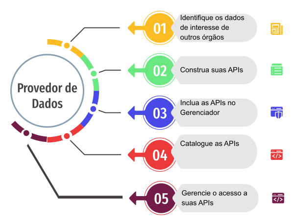

1. Pré-requisitos Técnicos para disponibilizar minha API na Plataforma
----------------------------------
  1. Deve estar disponível na internet através do protocolo https;
  2. Deve ser disponibilizada a documentação do serviço, preferencialmente no formato OpenAPI (ver Referências para Documentação de APIs);
  3. Deve ser disponibilizado ambiente de teste/homologação (não produtivo) para que seja possível testar a integração;
  4. Devem ser disponibilizadas credenciais de acesso, caso necessárias, para os ambientes de teste/homologação e produção;
  5. Deve ser cadastrado o certificado que foi fornecido pelo time do Conecta para que possa ocorrer o consumo do serviço, no caso onde a integração seja através de autenticação mútua;
  6. Deve ser informada a quantidade (capacidade) máxima de requisições por segundo que o serviço suporta;
  7. Deve ser definido o canal de comunicação com o suporte técnico do gestor do dado para que sejam informados possíveis problemas de indisponibilidade e/ou dúvidas durante a integração;
  8. Deve estar catalogada, ou em processo de catalogação, no catálogo do Conecta.
  

2. Como documentar minha API (Referências)
   
  * `Guia Básico de Documentação de APIs`_.
  * `Exemplo`_.
  * `Documenting APIs: A guide for technical writers and engineers`_.
  
  .. _`Guia Básico de Documentação de APIs`: https://stoplight.io/api-documentation-guide/basics/
  .._`Exemplo`: https://gist.github.com/iros/3426278
  .._`Documenting APIs: A guide for technical writers and engineers`: https://idratherbewriting.com/learnapidoc/

3. Como Gerenciar o acesso às minhas APIs.

Para gerenciar o acesso a suas APIs, o órgão provedor de dados indicará um integrante, que será cadastrado pela equipe interna no perfil Gestor de APIs.
Para disponibilizar suas APIs, o Gestor de APIs deve:

  1. **Cadastrar Plano de Consumo**.
    Um plano de consumo é o nome da associação de uma API com um limite de consultas. Ele especifica a quantidade máxima permitida de acessos à API para o período de um ano (limite de consumo).
    O Gestor de APIs pode realizar o controle de consumo de sua API através da definição de diferentes planos de consumo, que serão utilizados para limitar a consulta de diferentes órgãos recebedores de dados.
  2. **Cadastrar adesão a minha API pelos órgãos recebedores de dados.**
    (Não entendi, porque aqui é API com Plano de Consumo, mas o Plano de Consumo já tem a API no cadastro…)
    Além dessas funcionalidades, o Gestor de APIs também pode:
  3. **Listar Plano de Consumo.**
    Apresenta todos os planos de consumo cadastrados no Gerenciador de APIs do Conecta para este Gestor do Órgão.
  4. **Listar órgãos cadastrados.**
    Apresenta todos os órgãos cadastrados no Gerenciador de APIs do Conecta.
  5. **Cadastrar Gestor do órgão recebedor de dados.**
    Permite que um integrante do órgão recebedor de dados seja cadastrado com o perfil Gestor de API no Gerenciador de APIs do Conecta.
  6. **Listar Gestor do órgão recebedor de dados.**
    Apresenta todos os Gestores de APIs do órgão recebedor de dados.

4. Como fazer.

Esta é a tela inicial para o perfil Gestor de APIs, após o mesmo ter sido autenticado pelo Acesso gov.br:

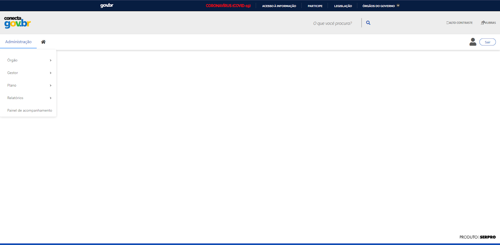

5. Listar Planos de Consumo.
>> No menu Administração, selecionar o item Plano > Listar Planos de Consumo

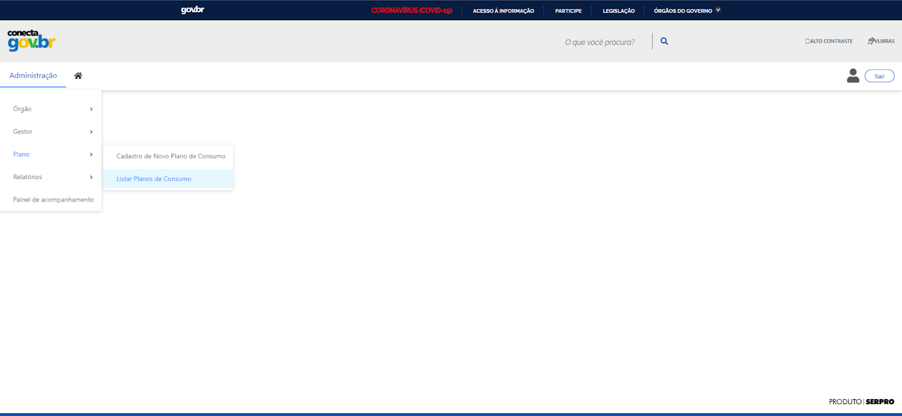

Os planos de consumo para as APIs do órgão provedordos dados podem ser filtrados de acordo com: 
  * Nome da API (incluindo todas);
  * Nome do Plano de Consumo;
  * Limite
  * Situação
Após a escolha dos filtros, que é opcional, basta acionar o botão “Pesquisar” para gerar a lista  dos planos de consumo de acordo com o critério de pesquisa definido pelos filtros.

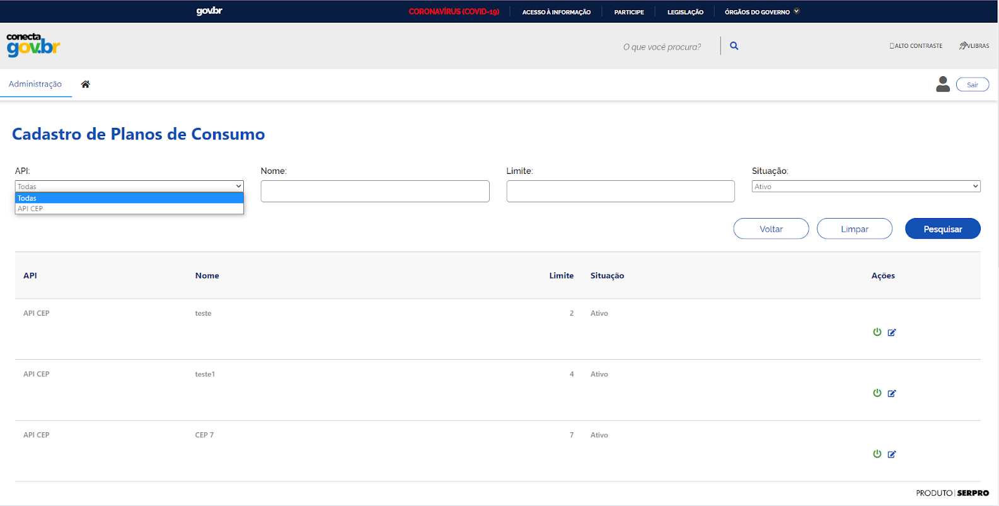

.. attention::
   A lista dos planos de consumo é apresentada em tela, com paginação e com as seguintes informações para cada plano de consumo:
     * Nome da API
     * Nome do Plano de Consumo
     * Limite do Plano de Consumo
     * Situação do Plano de Consumo
   A partir da lista, é possível executar as seguintes ações para cada item, conforme ilustrado na tela abaixo:
     1. Ativar/desativar o plano de consumo
     2. Alterar o plano de consumo
     3. Cadastrar adesão à API

     .. image:: _imagens/listarplanosdeconsumo_2.png
     :scale: 75 %
     :align: center
     :alt: Listar Planos de Consumo.
     .. image:: _imagens/listarplanosdeconsumo_3.png
     :scale: 75 %
     :align: center
     :alt: Listar Planos de Consumo.
A ação Ativar/desativar o plano de consumo faz com que o plano de consumo mude entre os estados ativado e desativado. Um plano de consumo ativado pode ser utilizado no cadastro de adesão de APIs, enquanto um desativado não permite a ação mencionada.

A ação Alterar o plano de consumo é similar à ação Cadastrar Plano de Consumo e seu modo de fazer está descrito na seção 3.2.1.2. Cadastrar Plano de Consumo
A ação Cadastrar adesão à API está descrita na seção 3.2.1.3. Cadastrar adesão à minha API pelos órgãos recebedores de dados

6. Cadastrar Plano de Consumo. 

>> No menu Administração, selecionar o item Plano >  Cadastro de Novo Plano de Consumo. 

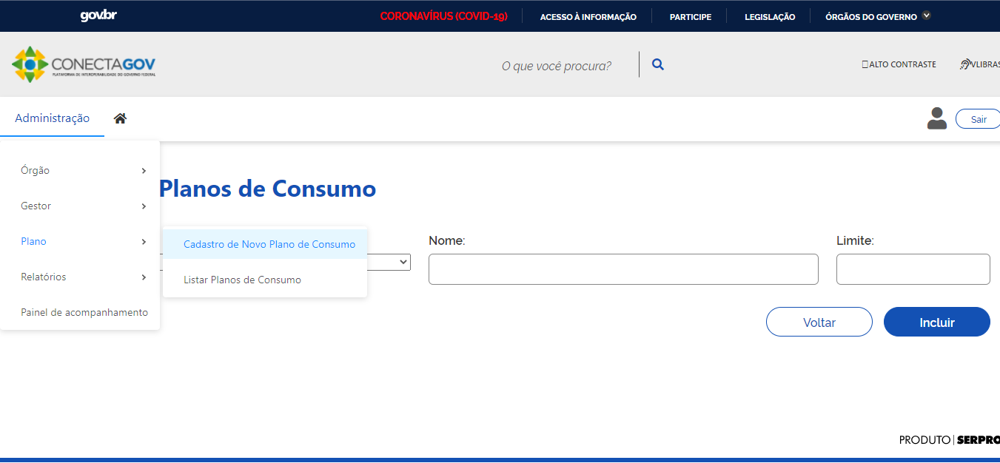

.. attention:: 
**Na tela de cadastro, o Gestor do Órgão deve:**
Associar o plano de consumo sendo criado com a API para a qual ele vai ser utilizado;
Preencher os campos com as informações do nome do plano de consumo e o limite permitido para o plano em questão (em quantidade de consultas).
Efetivar o cadastro pelo botão Incluir.

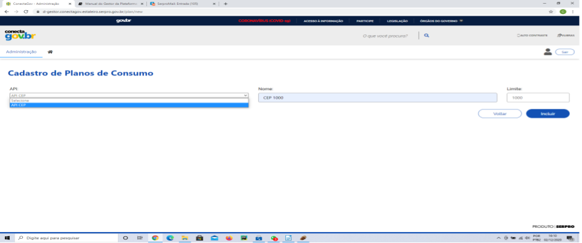

Será exibida mensagem com o resultado da realização da inclusão, na parte superior da tela, abaixo do menu.
Caso a inclusão seja realizada com sucesso:

.. image:: _imagens/cadastrarplanodeconsumo_3.png
 :scale: 75 %
 :align: center
 :alt: Cadastrar Plano de Consumo. 
------------------------------------------------------------------------------------------------------------------------
Caso seja a inclusão não tenha sido realizada:
------------------------------------------------------------------------------------------------------------------------
(Colocar imagem)
------------------------------------------------------------------------------------------------------------------------

Exemplo de preenchimento:
------------------------------------------------------------------------------------------------------------------------
(Colocar imagem)
------------------------------------------------------------------------------------------------------------------------
Após a inclusão do plano de consulta, a opção para alteração do mesmo é apresentada como botão na parte inferior direita da tela. 
A alteração é realizada da mesma forma que o cadastro, sendo que os campos são apresentados preenchidos com os dados correntes do plano de consumo para serem alterados.
------------------------------------------------------------------------------------------------------------------------

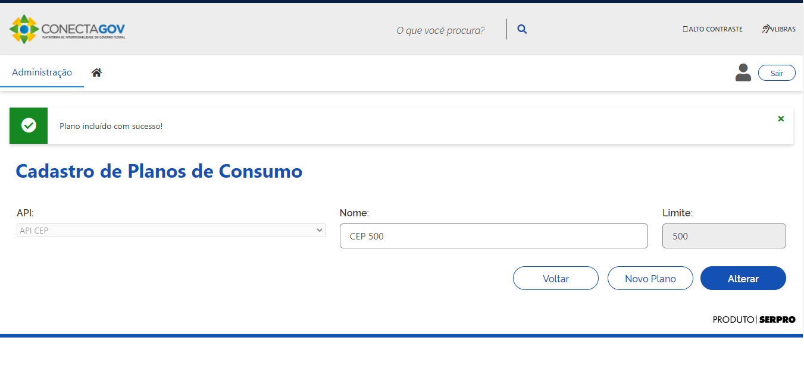

1. Cadastrar adesão à minha API.
   
>> A partir da ação Cadastrar adesão à API no item desejado da lista de planos de consumo (ver seção 3.2.1.1. Listar Planos de Consumo)
A tela de cadastro apresenta todas as adesões existentes para o órgão provedor de dados. O Gestor do Órgão deve:
  1. Associar o nome da API ao plano de consumo desejado;
  2. Efetivar o cadastro pelo botão Incluir.
    

  .. image:: _imagens/cadastraradesaoaminhaAPI_1.png
   :scale: 75 %
   :align: center
   :alt: Cadastrar adesão à minha API.

8. Listar Órgãos Cadastrados

>> No menu Administração, selecionar o item Órgão >  Listar Órgão

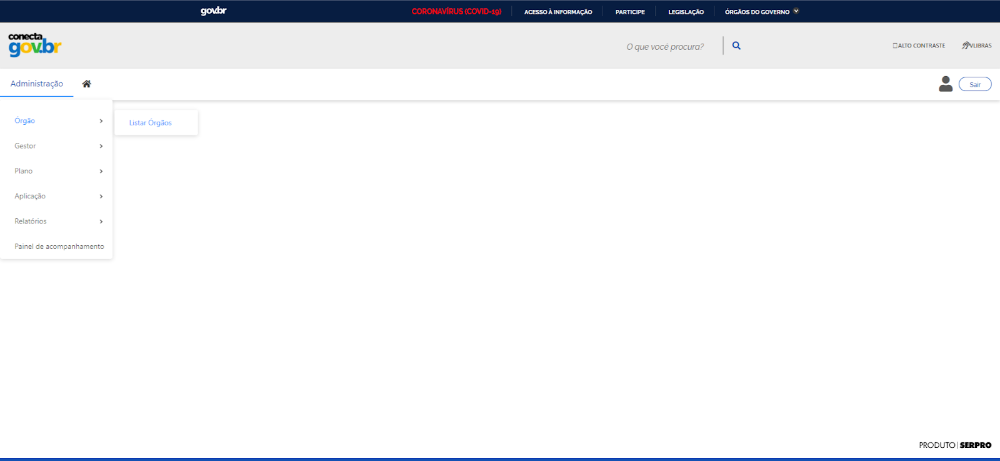

Os órgãos cadastrados podem ser filtrados de acordo com: 
Nome do Órgão
Situação 
Após a escolha dos filtros, que é opcional, basta acionar o botão “Pesquisar” para gerar a lista  dos órgãos de acordo com o critério de pesquisa definido pelos filtros.
A lista dos órgãos é apresentada em tela, com paginação e com as seguintes informações para cada órgão:
Nome do Órgão
Sublista com as adesões existentes
Situação
A partir da lista, é possível executar a seguinte ação para cada órgão, conforme ilustrado na tela abaixo:
???

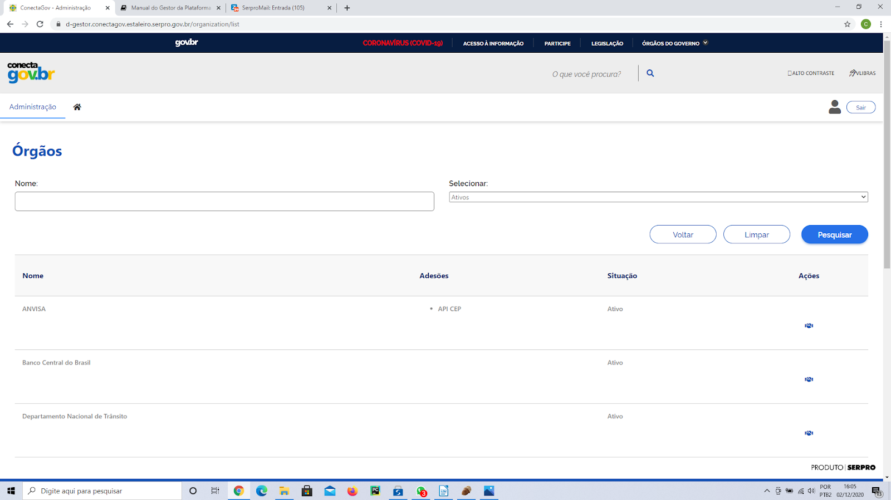
9. Listar Gestor do órgão recebedor de dados. 
   
No menu Administração, selecionar o item Gestor >  Listar Gestores

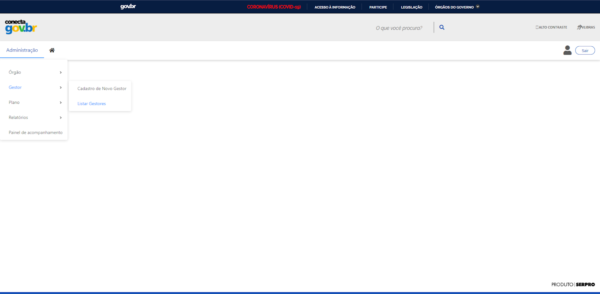

Os gestores podem ser filtrados de acordo com: 
  * Nome do Órgão
  * Número do CPF
  * Nome
Selecionar (drop-down)
Após a escolha dos filtros, que é opcional, basta acionar o botão “Pesquisar” para gerar a lista  dos gestores de acordo com o critério de pesquisa definido pelos filtros.
A lista dos gestores é apresentada em tela, com paginação e com as seguintes informações para cada gestor:
 * CPF
 * Nome
 * Órgão
 * Data de início do período de gestão
 * Data de fim do período de gestão
A partir da lista, é possível executar as seguintes ações para cada gestor, conforme ilustrado na tela abaixo:
  1. Ativar/Inativar do gestor.
  2. Alterar os dados do gestor.

.. image:: _imagens/listargestordoorgaorecebedordedados_2.png
 :scale: 75 %
 :align: center
 :alt: Listar Gestor do órgão recebedor de dados. 

A ação Ativar/desativar o gestor faz com que o gestor mude entre os estados ativado e desativado. Um gestor desativado não pode ???
A ação Alterar os dados do gestor é similar à ação Cadastrar Gestor do órgão recebedor de dados e seu modo de fazer está descrito na seção 3.2.1.5. Cadastrar Gestor do órgão recebedor de dados

10. Cadastrar Gestor do órgão recebedor de dados. 
>> No menu Administração, selecionar o item Gestor >  Cadastro de Novo Gestor.

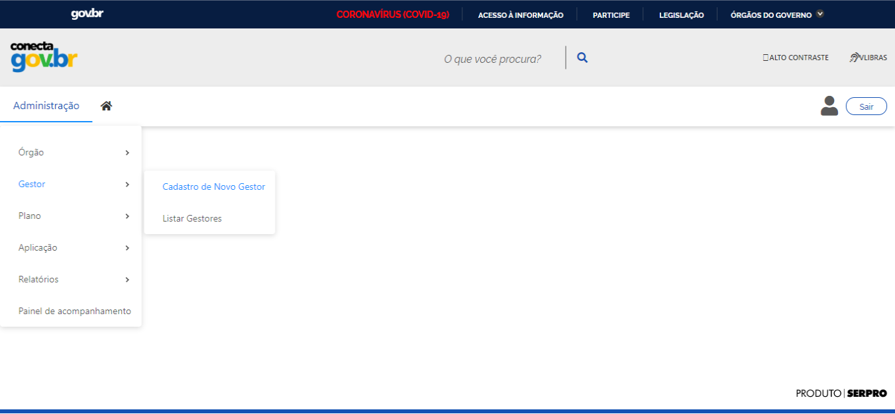

Nesta tela, o Gestor do Órgão deve 
  1. Selecionar o órgão do gestor sendo cadastrado. Caso o órgão selecionado seja vinculado ao SIAPE:
   a. Informar o CPF do gestor;
   b. Utilizar o botão Pesquisar Servidor, que busca automaticamente os dados restantes de cadastro para o CPF informado.
   c.  Efetivar o cadastro pelo botão Incluir.

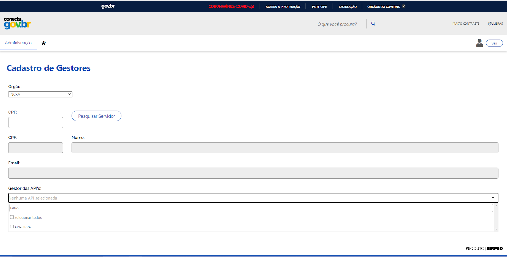
   2. Caso o órgão selecionado NÃO seja vinculado ao SIAPE:
       a. Informar o CPF do gestor;
       b. Informar os dados de cadastro do gestor;
       c. Efetivar o cadastro pelo botão Incluir.

       .. image:: _imagens/listargestordoorgaorecebedordedados_5.png
          :scale: 75 %
          :align: center
          :alt: Listar Gestor do órgão recebedor de dados.

   

     

