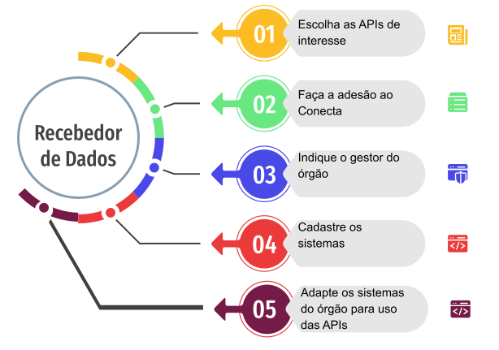
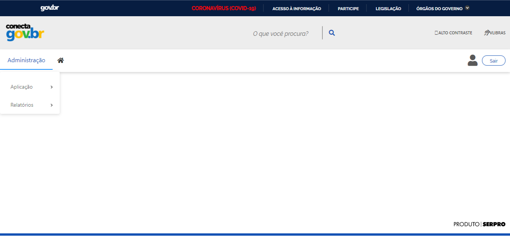
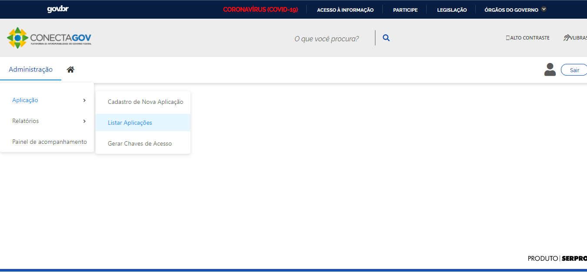
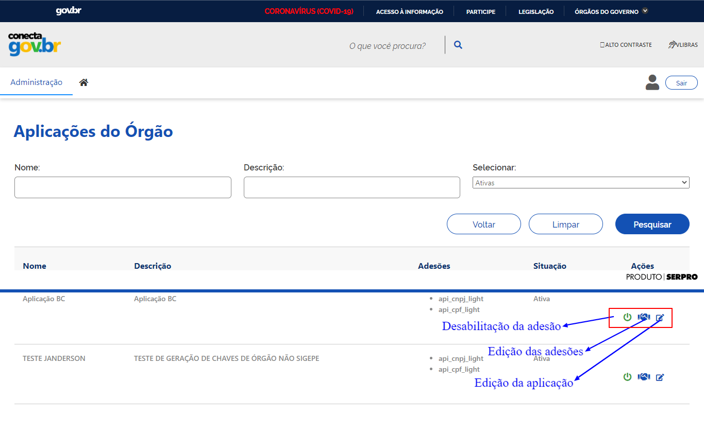

 Sou Recebedor de Dados
*********************************************

O Gerenciador de APIs é ideal para encontrar e para agilizar o consumo de APIs de diversos órgãos.

1. Escolha as APIs de interesse
----------------------------------
Acesse o Catálogo de APIs do Conecta_ e encontre as APIs de interesse para seu órgão.
Neste Catálogo,  é possível encontrar as APIs em destaque ou buscar elas APIs organizadas por tema. O catálogo ainda provê várias informações sobre a API como suas  principais operações, como  proceder para acessar a API,detalhamento técnico, informações de contato e informações técnicas tais como tecnologias e controle de acesso. Verifique se as APIs são disponibilizadas diretamente pelo órgão ou se são gerenciadas pelo Gerenciador do Conecta.

.. _Conecta: http://gov.br/conecta/catalogo

2. Faça a adesão ao Conecta
----------------------------------------

.. important::
   Para obter o acesso às APIs gerenciadas pelo Conecta o órgão deverá aderir ao programa Conecta. Para adesão serão solicitadas algumas informações sobre o consumo de dados, a finalidade do uso dos dados (em conformidade com a LGPD), a volumetria estimada anual de consumo das APIs e os representantes do órgão no processo.
   Entre em contato com a equipe Conecta para obter mais informações sobre o processo de adesão e o modelo de ofício de adesão.

3.  Indique o gestor do órgão
--------------------------------

O órgão deverá indicar o Gestor do Órgão responsável por gerenciar o acesso a todas as APIs que o órgão terá acesso e acompanhar o consumo destas APIs. Este Gestor quem deverá obter as chaves de acesso para consumo das APIs e para isto precisará de um certificado digital ICP-Brasil.

4.  Cadastre as aplicações
-----------------------------------------

O Gestor deverá cadastrar as aplicações ou sistemas do órgão que forem consumir as APIs e obter as chaves de acesso específicas para cada aplicação. A geração de diferentes chaves de acesso é aconselhada para melhor controle do acesso e do consumo das APIs.
Após obter as chaves de acesso, encaminhe-as para os responsáveis técnicos pelo desenvolvimento das integrações.

5.  Adapte os sistemas do órgão para uso das APIs
--------------------------------------------------

Agora que já tem acesso às APIs, o órgão deve adaptar as aplicações ou sistemas para usar as APIs disponibilizadas. Para isto, os responsáveis técnicos necessitarão das chaves de acesso e da documentação técnica das APIs disponíveis no `Catálogo de APIs do Conecta`_.

.. _`Catálogo de APIs do Conecta`: http://gov.br/conecta/catalogo

.. important::
   O Gestor do Órgão deverá:
   1. Logar na Plataforma
------------------------  

     O login na plataforma é realizado por meio do Acesso gov.br, podendo ser feito com senha ou certificado digital. 
 
   2. Cadastrar Aplicação
-----------------------
     O Gestor do Órgão cadastra a aplicação que irá realizar o acesso à API.
     Sugere-se que sejam cadastradas aplicações diferentes para sistemas diferentes do órgão, de tal forma que o controle de consumo possa ser feito de maneira mais detalhada.
 
    3. Gerar chave de acesso
-------------------------
     O Gestor do Órgão assina o termo de responsabilidade para uso dos dados e gera a chave de acesso.
     Para cada aplicação, o Gestor do Órgão deve ler e assinar eletronicamente o termo de responsabilidade, com certificado digital, e gerar a chave de acesso que vai permitir a integração da aplicação com a API em questão. 
     O termo de responsabilidade é associado à chave de acesso gerada. Ressaltamos a necessidade do Gestor do Órgão fazer o download do termo de responsabilidade.
     Uma chave de acesso é uma sequência de números e letras (alfanumérico) que representam uma credencial de acesso. Esta credencial de acesso é informada no acesso a uma API para identificar o aplicativo de chamada ou o usuário e usada para monitorar e controlar a forma como a API está sendo utilizada.
     Quando gerada outra chave de acesso para a mesma aplicação, a chave de acesso anterior passa a ter um período de validade de 6 (seis) meses.
     As chaves de acesso não são armazenadas na plataforma e, portanto, não podem ser recuperadas. É responsabilidade do Gestor do Órgão armazenar a sua chave de acesso de forma segura.
   4. Encaminhar internamente a chave de acesso para o responsável técnico.

**Como fazer:**
Esta é a tela inicial para o perfil Gestor do Órgão, após o mesmo ter sido autenticado pelo Acesso gov.br:

1. Cadastrar Aplicação
   
>> No menu Administração, selecionar o item Aplicação >  Cadastro de Nova Aplicação.
Nesta tela, o Gestor do Órgão deve 
  1. Preencher todos os campos com os detalhes da aplicação que irá realizar o acesso à API; 
  2. Associar a aplicação com a API desejada, selecionando na lista apresentada; e 
  3. Efetivar o cadastro pelo botão Incluir.

  .. image:: _imagens/cadastraraplicacao_1.png
   :scale: 75 %
   :align: center
   :alt: Cadastrar de Nova Aplicação.

  Será exibida mensagem com o resultado da realização da inclusão, na parte superior da tela, abaixo do menu.
  **Caso a inclusão seja realizada com sucesso:**
  
  .. image:: _imagens/cadastraraplicacao_2.png
    :scale: 75 %
    :align: center
    :alt: Cadastrar de Nova Aplicação.

  Caso seja a inclusão não tenha sido realizada:

  .. image:: _imagens/faltaaimagem
  :scale: 75 %
  :align: center
  :alt: faltaaimagem.

  Exemplo de preenchimento:
  .. image:: _imagens/cadastraraplicacao_2.png
   :scale: 75 %
   :align: center
   :alt: Cadastrar de Nova Aplicação.

1. Listar Aplicações.

>> No menu Administração, selecionar o item Aplicação > Listar Aplicações
As aplicações já cadastradas pelo Gestor do Órgão são listadas.

É possível definir filtros para lista apresentada por meio dos campos apresentados na parte superior da tela. O preenchimento dos campos de filtro de pesquisa é opcional e, quando não preenchido, realiza a pesquisa para todas as aplicações. 
O resultado da pesquisa será apresentado de forma paginada, conforme mostrado abaixo. 
A partir dos ícones apresentados na parte direita para cada item da lista, é possível realizar as seguintes ações para uma determinada aplicação listada:
   1. ativação/desativação.
   2. alteração.

3. Ativar ou Desativar Aplicação .
   
  >> No menu Administração, selecionar o item Aplicação > Listar Aplicações
  Na lista de aplicações, cada aplicação, como item da lista, apresenta dois ícones de ação à sua direita. 
  Para ativação ou desativação de uma determinada aplicação, deve-se selecionar o ícone (inserir ícone).
  (Inserir o que acontece depois do ícone selecionado)

  .. image:: _imagens/ativardesativar_1.png
   :scale: 75 %
   :align: center
   :alt: faltaaimagem.

4. Alterar Aplicação. 
  >> No menu Administração, selecionar o item Aplicação > Listar Aplicações
  Na lista de aplicações, cada aplicação, como item da lista, apresenta dois ícones de ação à sua direita. 
  Para alteração de uma determinada aplicação, deve-se selecionar o ícone (inserir ícone).
  (Inserir o que acontece depois do ícone selecionado)
  (Apresenta outra tela? Se sim, adicionar e explicar a tela)

  .. image:: _imagens/alteraraplicao_1.png
   :scale: 75 %
   :align: center
   :alt: Alterar Aplicação.

5. Gerar Chave de Acesso.
  >> No menu Administração, selecionar o item Gerar Chaves de Acesso.
  .. image:: _imagens/gerarchave_1.png
   :scale: 75 %
   :align: center
   :alt: Gerar Chave de Acesso.

  **São requisitos para a geração da chave:**
  Gestor do Órgão possuir certificado digital ICP-Brasil.
  Assinador Digital SERPRO estar instalado.

  A chave de acesso são as credenciais que a aplicação cadastrada vai utilizar para poder acessar a API desejada. 
  O Portal do Gestor identifica automaticamente se o Assinador Digital SERPRO está instalado. Caso não tenha sido efetuada a instalação, a tela para gerar chaves de acesso apresenta as orientações para tanto.
  .. image:: _imagens/gerarchave_2.png
   :scale: 75 %
   :align: center
   :alt: Gerar Chave de Acesso.

  Com o Assinador Digital SERPRO instalado, o Gestor do Órgão poderá prosseguir com a geração da chave. 
  Primeiramente, deve selecionar a aplicação para a qual deseja gerar uma chave de acesso, cadastrada anteriormente.

  .. image:: _imagens/gerarchave_3.png
   :scale: 75 %
   :align: center
   :alt: Gerar Chave de Acesso.
  
  Em seguida, deve selecionar a API que deseja acessar. Apenas APIs cujo Gestor do Órgão tem autorização são apresentadas para seleção.
  
  .. image:: _imagens/gerarchave_4.png
   :scale: 75 %
   :align: center
   :alt: Gerar Chave de Acesso.

  O Gestor do Órgão deve ler o Termo de Responsabilidade. Este Termo possui identificação única e dados do Gestor do Órgão. Se algum dado não estiver correto, o Gestor do Órgão deve entrar em contato pelo email conecta@economia.gov.br.

  Após a leitura, o Gestor do Órgão assina o Termo de Responsabilidade, utilizando o seu certificado digital.

  (Inserir tela com o botão para assinar o termo de responsabilidade)

  Para finalizar e realizar a geração da chave de acesso, deve acionar o botão “Gerar Chave”, embaixo, à direita.
  Quando a geração da chave foi realizada com sucesso, é apresentada tela com mensagem de sucesso no topo e a chave de acesso e a senha como campos editáveis na parte de baixo da tela.
  
  O Gestor do Órgão encaminha as chaves de acesso para o responsável técnico pelo sistema consumidor da API que deverá fazer a implementação necessária para acessar a mesma.
  
  .. image:: _imagens/gerarchave_5.png
   :scale: 75 %
   :align: center
   :alt: Gerar Chave de Acesso.
  O Gestor do Órgão deve copiar e salvar a chave de acesso e a senha, apresentadas como campos editáveis na parte de baixo da tela, em arquivo seguro. Não é possível recuperar essas informações após sair desta tela.
  Em caso de perda ou necessidade de geração de nova chave, deverá seguir novamente o processo aqui descrito, com a assinatura de um novo Termo de Responsabilidade e revogação da chave anterior.
  O Gestor do Órgão também deve salvar o Termo de Responsabilidade. Para tanto, deve acionar o botão “Termo de Responsabilidade”. Não é possível recuperar o Termo de Responsabilidade após sair desta tela. 
  ------------------------------------------------------------------------------------------------------------------------
  (Inserir tela com o botão para salvar o termo de responsabilidade)
  ------------------------------------------------------------------------------------------------------------------------
  
  (Explicar e inserir tela para o caso que não tem sucesso)

  6. Como acontece o acesso da minha aplicação?
     
  A chave de acesso é composta por um código de usuário e uma senha (chave pública e chave privada). O Portal do Gestor armazena somente o código do usuário para realizar a associação com o termo de responsabilidade assinado digitalmente pelo Gestor do Órgão. A chave privada enviada ao gestor não é armazenada no Portal do Gestor.
  O Portal do Gestor habilita a emissão do tíquete temporário (token), que será utilizado para o acesso dos serviços das APIs.
  Para gerar o token temporário, a aplicação consumidora do órgão envia uma requisição para o Gerenciador de API, passando as chaves de acesso geradas para o Gestor (código do usuário e senha). O Gerenciador de API valida as chaves de acesso e, em caso positivo, retorna um token temporário que permite o acesso à API. O Gerenciador de API associa o token gerado à chave do usuário (código do usuário) que, por sua vez, é associado ao Termo de Responsabilidade. Dessa forma, todo o acesso é registrado e associado ao Termo de Responsabilidade assinado pelo Gestor. 
  As requisições enviadas ao Gerenciador de API são identificadas com o IP de origem, o token temporário, o sistema consumidor, e o CPF do usuário que deseja fazer a consulta. A partir do token temporário é possível identificar a chave de acesso do usuário (código do usuário) que está fazendo a requisição.
  O Gerenciador de API recebe essas informações e encaminha uma requisição de consulta à API. Para a API CPF Light, a comunicação do Gerenciador de API com o ambiente da RFB onde a mesma está disponibilizada é feita através de certificado digital de e-Equipamento ICP-Brasil .
  O Gerenciador de API armazena em log todas as informações necessárias para garantir a rastreabilidade e o não repúdio de cada requisição: 
    * IP origem;
    * Chave do usuário Gestor do Órgão;
    * CPF do usuário que realizou a consulta;
    * Data e hora da transação e resultado da consulta retornada.

7. Aspectos relacionados à LGPD para o Recebedor de Dados

  

 
